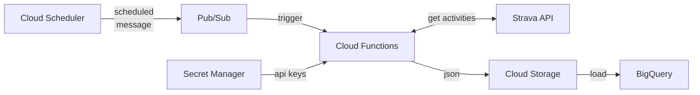

# strava-api-gcp

Python functions to extract Strava athlete activities from [Strava API](https://developers.strava.com/) and output to Google Cloud Storage.
Functions are intended for use with individual Strava accounts and for deployment on GCP Cloud Functions.

## Configuration



- Set up API application on Strava and retrieve Client ID, Client Secret, Refresh Token
- Store API Client Secret and Refresh Token in GCP Secret Manager
- Create an output bucket on Cloud Storage
- Create a Cloud Schedule publishing an arbitrary Pub/Sub message to trigger Cloud Function
- Deploy a Cloud Function
    - Use service account with required permissions:
        - Secret Accessor/Viewer on Secret Manager secrets
        - Object Admin on Cloud Storage bucket
    - Mount Client Secret and Refresh Token secrets
    - Configure environment variables as described below
    - Set Pub/Sub topic configured above as trigger
    - Set extract_strava_activities as entry point
- Create a BigQuery dataset and ingest from GCS as required

## Environment Variables

Note that Strava API is rate limited to 100 requests/15min and 1,000 requests/day. Choose api_time_window wisely, safe upper limit will depend on the number of activities published on the athlete account.

| Name | Example | Description |
| -- | -- | -- |
| gcs_bucket_name | strava_61987159 | Target GCS bucket for JSON output |
| gcs_file_name | activities.json | Name of output JSON file |
| api_client_id | 12345 | API Cliend ID from Strava API App configuration |
| api_time_window_offset | 0 | Number of seconds to subtract from current timestamp for created_before API parameter |
| api_time_window | 259200 | Size of the lookback window in seconds, used to calculate created_after API parameter |
| api_client_secret_mount_ref | /api-client-secret/strava-api-client-secret | Reference to Strava API Client Secret string, mounted locally |
| api_refresh_token_mount_ref | /api-refresh-token/strava-api-refresh-token | Reference to Strava API Refresh Token string, mounted locally |

## Loading to BigQuery

SQL to load JSON activity file from Cloud Storage to BigQuery:

```sql
load data overwrite dataset.table (
  resource_state INT64,
  athlete JSON,
  name STRING,
  distance FLOAT64,
  moving_time INT64,
  elapsed_time INT64,
  total_elevation_gain FLOAT64,
  type STRING,
  sport_type STRING,
  workout_type INT64,
  id INT64,
  start_date TIMESTAMP,
  start_date_local TIMESTAMP,
  timezone STRING,
  utc_offset FLOAT64,
  location_city STRING,
  location_state STRING,
  location_country STRING,
  achievement_count INT64,
  kudos_count INT64,
  comment_count INT64,
  athlete_count INT64,
  photo_count INT64,
  map JSON,
  trainer BOOL,
  commute BOOL,
  manual BOOL,
  private BOOL,
  visibility STRING,
  flagged BOOL,
  gear_id INT64,
  start_latlng ARRAY<FLOAT64>,
  end_latlng ARRAY<FLOAT64>,
  average_speed FLOAT64,
  max_speed FLOAT64,
  average_cadence FLOAT64,
  average_watts FLOAT64,
  max_watts INT64,
  weighted_average_watts INT64,
  kilojoules FLOAT64,
  device_watts BOOL,
  has_heartrate BOOL,
  average_heartrate FLOAT64,
  max_heartrate FLOAT64,
  heartrate_opt_out BOOL,
  display_hide_heartrate_option BOOL,
  elev_high FLOAT64,
  elev_low FLOAT64,
  upload_id INT64,
  upload_id_str STRING,
  external_id STRING,
  from_accepted_tag BOOL,
  pr_count INT64,
  total_photo_count INT64,
  has_kudoed BOOL,
  suffer_score FLOAT64,
  description STRING,
  calories FLOAT64,
  perceived_exertion FLOAT64,
  prefer_perceived_exertion BOOL,
  segment_efforts JSON,
  splits_metric JSON,
  splits_standard JSON,
  laps JSON,
  best_efforts JSON,
  photos JSON,
  stats_visibility JSON,
  hide_from_home BOOL,
  device_name STRING,
  embed_token STRING,
  private_note STRING,
  similar_activities JSON,
  available_zones JSON
)
from files (format='newline_delimited_json', uris=['gs://bucket/activities.json']);
```
